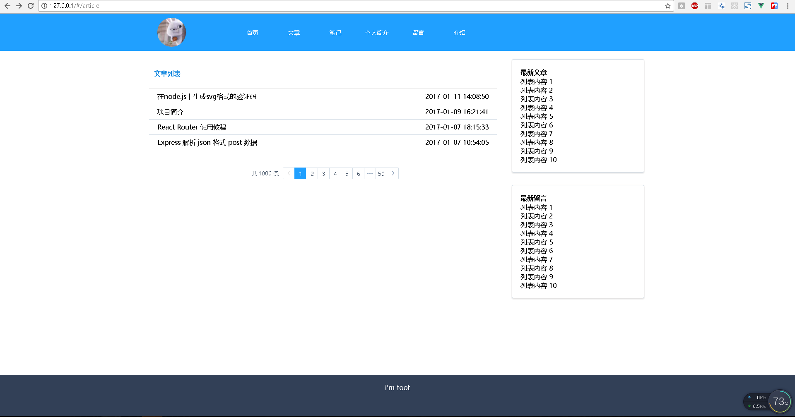

# mericVue2
>this is a vue2 project demo，build with vue2/vue-router/vuex/element-ui
  
>刚学一星期的vue2，重新做我之前用react做的那个博客[React-Personal-Blog](https://github.com/unclemeric/React-Personal-Blog)(由于工作关系，也还没完全做好...),效果请看根目录demo.png，数据是跨域api从另一个nodejs的项目[BlogAPI](https://github.com/unclemeric/BlogAPI)中获取的。本项目还在写。。。琢磨中



```
增加国际化功能，注意vue-i18n库版本不能安装最新版的(目前6.0)，最新版的会报错(一个坑(⊙﹏⊙)b，里面的方法没更新过来)，我用的是4.7.3版本的
```